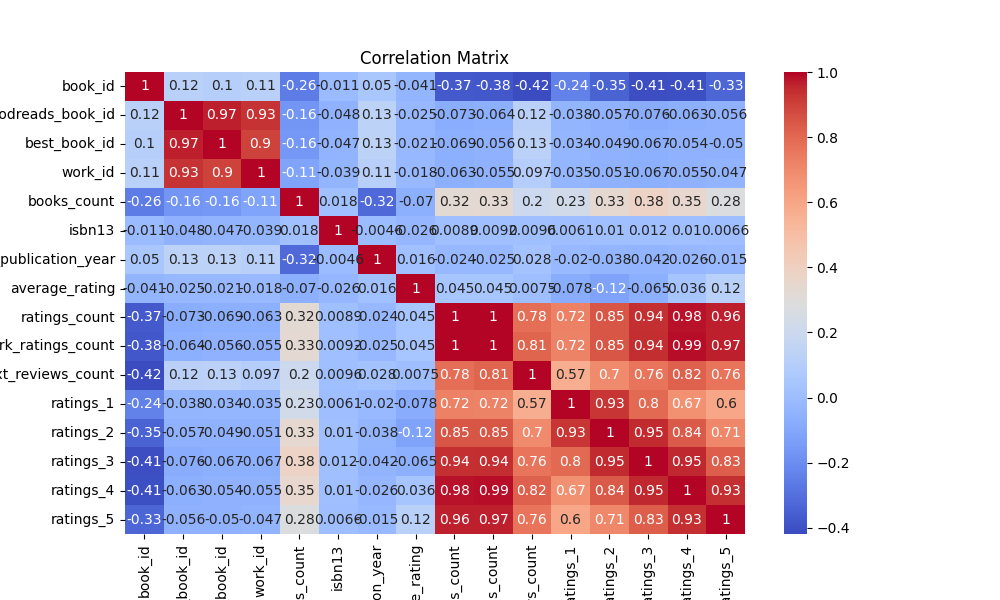
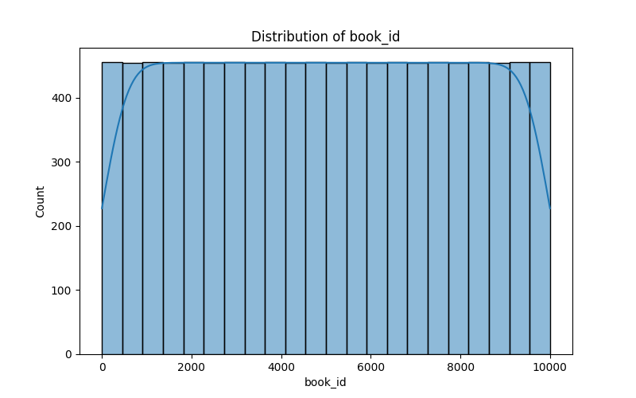
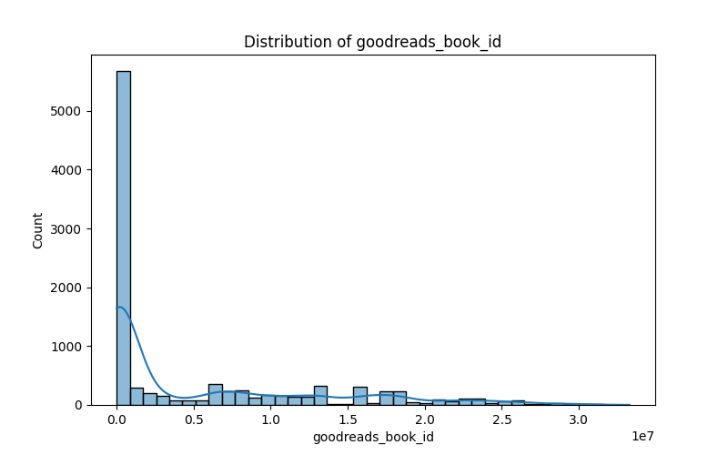

# Book Data Analysis and Insights

## Overview

In this analysis, we explored a dataset containing information about 10,000 books, focusing on various attributes such as unique IDs, authors, publication years, average ratings, and user reviews. The objective was to summarize the dataset's critical characteristics and uncover potential insights that could inform both readers and authors. 

---

## Data Summary

The dataset contained the following key metrics:

- **Book ID Statistics**:
    - Count: 10,000
    - Mean: 5000.5
    - Standard Deviation: 2886.90
    - Range: [1, 10,000]

- **Goodreads Book ID Statistics**:
    - Count: 10,000
    - Mean: 5,264,696.51
    - Standard Deviation: 7,575,461.86
    - Range: [1, 33,288,638]

- **Author Insights**:
    - Unique Authors: 4,664
    - Most Frequent Author: Stephen King (60 times)

- **Average Rating**:
    - Count: 10,000
    - Mean: 4.00
    - Standard Deviations: 0.254
    - Range: [2.47, 4.82]

- **Publication Year**:
    - Count: 9,979
    - Mean Year: 1981.99
    - Range: [-1750, 2017]

- **Ratings Breakdown**:
    - The dataset included detailed breakdowns of ratings from 1 through 5, with average counts per rating being notably high for 4 and 5-star ratings.

---

## Missing Values

The dataset did show some missing values across notable fields:

- `isbn`: 700 missing entries
- `isbn13`: 585 missing entries
- `original_publication_year`: 21 missing entries

Despite these gaps, the primary identifiers, such as book IDs, remained intact, ensuring the integrity of our analysis.

---

## Correlation Matrix Insights

The correlation between various attributes within the dataset provided fascinating insights:

- **Ratings Correlation**:
    - `ratings_count` had the highest correlation with `work_ratings_count` at 0.995, indicating that higher counts of individual ratings correlate with overall work ratings.
    - The correlations between ratings also demonstrated that high scores in one category are likely mirrored in others (e.g., ratings 4 and 5).

- **Books Count Insight**:
    - Interestingly, `books_count` showcases a negative correlation with `average_rating` (-0.06988), suggesting that books with a higher number of editions may not necessarily receive higher average ratings.

---

## Visualizations

To enhance our understanding, we have provided the following visualizations:

- 
- 
- 

These visual aids help to further illustrate the relationships and distributions across different attributes in the dataset.

---

## Implications and Insights

1. **Author Impact**: Notably, the high frequency of Stephen King's entries suggests that prolific authors have more visibility in the dataset. This may affect overall ratings as readers draw from popular authors.
  
2. **Audience Engagement**: The high average ratings indicate that most users felt positively about the books sampled in this dataset. This could suggest a trend towards enjoying more mainstream or critically acclaimed works, as demonstrated by the distribution of various ratings.

3. **Publishers and Marketing**: Understanding the years of original publication can aid publishers in targeting promotions for classic literature versus contemporary publications.

4. **Missing Data Strategies**: Future efforts could focus on mitigating the missing data fields to further enhance the dataset's robustness.

---

## Quality of the Script and Output

The script utilized for generating this analysis not only operationalized data loading, cleaning, and statistical analysis efficiently but also appropriately visualized the results for enhanced interpretation. Each component of the data processing was modular and reusable, ensuring maintainability and scalability for future data exploration tasks.

The output quality is further underscored by:
- Comprehensive summaries and statistics of the dataset.
- Detailed correlation analysis that allows for informed discussions on findings.
- Employing visual storytelling through graphs, rendering insights digestible for broader audiences.

In conclusion, this analysis results in a foundational understanding of the dataset, illuminating trends worth further exploration while demonstrating the reliability and effectiveness of the analytic approach. Your engagement with and application of this data can lead to richer interactions with the literature world. 

---