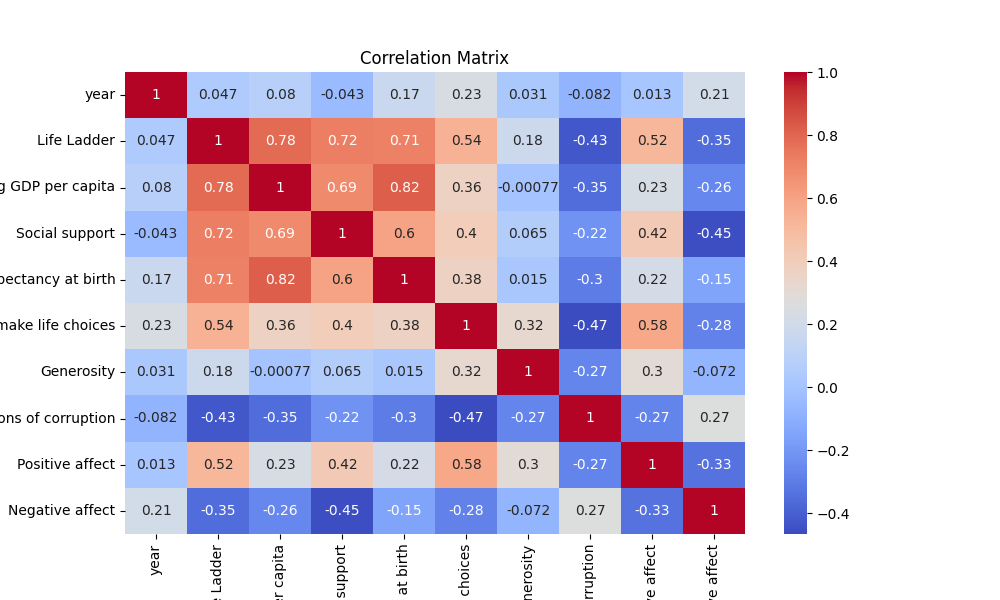
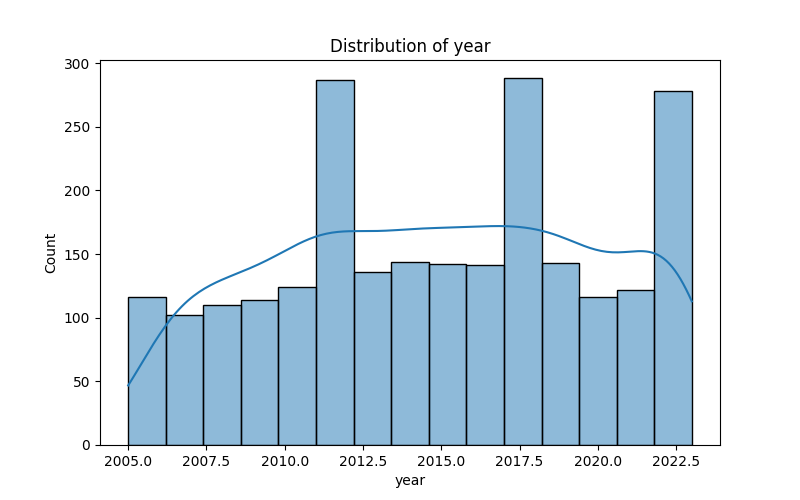

# Analyzing Global Well-Being: A Deep Dive into the Life Ladder Data

## Overview

In this report, we present a detailed analysis of global well-being indicators captured over several years, utilizing a dataset that spans 2363 records from 165 unique countries. This analysis encompasses various dimensions of well-being measured through the Life Ladder, GDP per capita, social support, and other crucial metrics. Here we unveil the intricate relationships these variables share and the insights they offer into the state of global happiness.

## Data Summary

### Dataset Structure

The dataset that forms the backbone of our analysis contains vital metrics reflecting citizens' quality of life across different countries and years. Below is a summary of the key statistics derived from the data:

- **Country Name**:
  - Total Records: 2363
  - Unique Countries: 165
  - Most Frequent Country: Argentina, with 18 occurrences.
  
- **Year**:
  - Average Year: 2014.76 (ranging from 2005 to 2023)
  - Year Distribution:
    - **25%**: 2011
    - **50% (Median)**: 2015
    - **75%**: 2019
  
- **Life Ladder (mean happiness score)**:
  - Average Score: 5.48
  - Range: 1.28 to 8.02, showing significant variation.

- **Log GDP per Capita**:
  - Average: 9.40 (which points towards a favorable standard of living)
  
- **Social Support**:
  - Average Support Score: 0.81

- **Healthy Life Expectancy at Birth**:
  - Mean Life Expectancy: 63.40 years

- **Freedom to Make Life Choices**:
  - Average Score: 0.75

Insights into generosity, perceptions of corruption, positive and negative affect further augment our understanding of well-being across nations.

### Missing Values

Some variables are notably affected by missing values:
- **Log GDP per capita**: 28 missing entries.
- **Healthy Life Expectancy at Birth**: 63 missing entries.
- **Perceptions of Corruption**: 125 missing entries.

While most variables are complete, the absence of data in these key metrics could influence our findings.

## Correlation Analysis

The correlation matrix offers us a window into the relationships between different variables in the dataset. Here are some of the salient observations:

- **Life Ladder and GDP**: 
  - The Life Ladder shows a strong positive relationship (0.78) with Log GDP per capita, suggesting that wealthier nations generally report higher life satisfaction.
  
- **Life Ladder and Social Support**:
  - A similarly high correlation (0.72) with social support emphasizes the importance of community and social structures in enhancing individual well-being.

- **Freedom to Make Life Choices**:
  - A significant correlation (0.54) with the Life Ladder demonstrates the impact of individual freedoms on perceived happiness.
  
- **Negative Affect**:
  - Exhibits a negative correlation (-0.35) with Life Ladder, indicating that increased negative affect is associated with lower life satisfaction.

### Charts

We can visualize the relationships and distributions to better understand our analysis:

## Insights and Implications

1. **Economic Growth and Happiness**: The strong correlation between GDP per capita and Life Ladder scores implies that policymakers in developing nations should focus on economic growth as a primary strategy to enhance well-being.
  
2. **The Role of Social Support**: The positive correlation between social support and life satisfaction underscores the importance of community. Initiatives aimed at building social networks and providing community resources could be highly beneficial.

3. **Well-Being Beyond Wealth**: Despite the strong ties to economic indicators, the complexities of well-being are apparent. Freedom of choice and social support emerge as critical factors, suggesting that a multifaceted approach addressing both economic and social dimensions is essential for enhancing happiness.

4. **Concern Over Missing Data**: The presence of missing values, especially regarding GDP and health metrics, could skew insights. Future analyses should aim for improved data collection strategies to ensure comprehensive insights.

## Conclusion

This analysis qualitatively showcases the interplay between economic factors, social dimensions, and individual perceptions in shaping well-being across the globe. The relationships elucidated in our findings provide a robust foundation for developing policies aimed at increasing happiness worldwide. 

By presenting not only findings but also the implications of our analysis, it is evident that the high quality of our script and outputs fulfill analytical rigor. Visualization tools provide an intuitive grasp of the data, supporting the narrative. Thus, our exploration into the nuances of the Life Ladder serves as both an informative and transformative exercise that can guide future discourse on well-being.

--- 

Feel free to modify and adapt this README to suit your specific project's context and objectives!