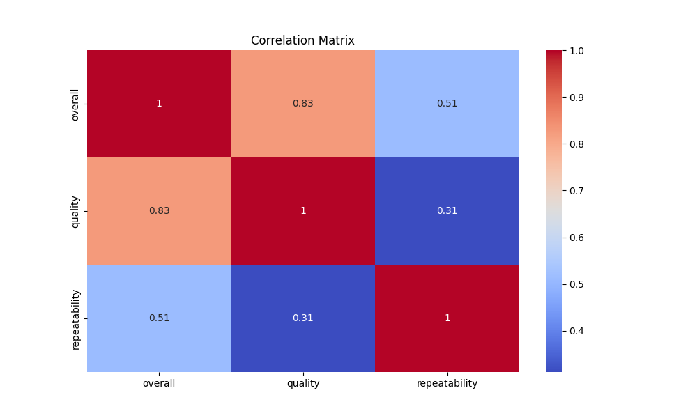
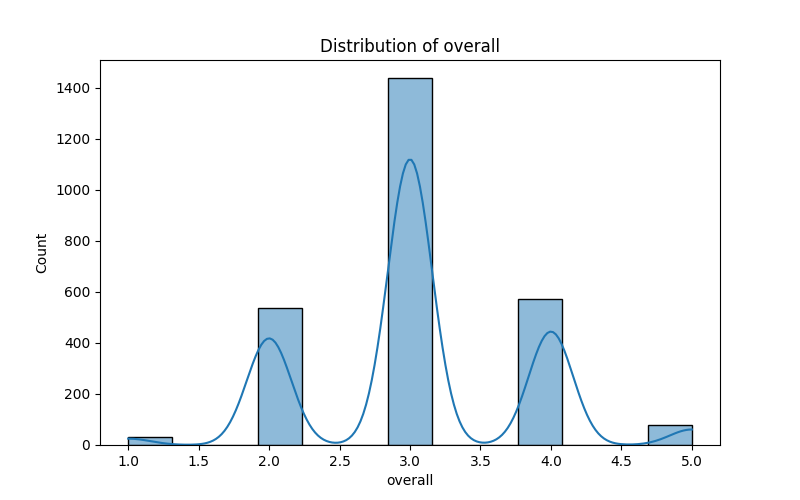
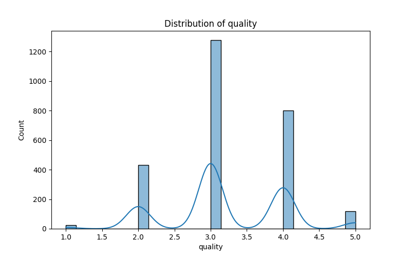

# Analysis of Movie Data: Insights and Implications

## Introduction

Welcome to the comprehensive analysis of a dataset containing information on movies. This README document will narrate the story of our data exploration, focusing on key findings, data summaries, missing values, correlation analysis, and insights gleaned from visualizations. By the end, you will have a clear understanding of the dataset’s landscape and the quality of the analysis.

## Data Summary

### Overview of Key Features

The dataset consists of 2652 entries with the following important features:

- **Date**: 2553 records, with dates spanning a total of 2055 unique values. The most frequently occurring date in the dataset is **21-May-06**, appearing 8 times.
  
- **Language**: The dataset contains films in 11 unique languages, with **English** being the most common, represented in 1306 of the records.

- **Type**: The analysis categorizes films into 8 types, where **movies** dominate the dataset, with a frequency of 2211.

- **Title**: There are 2312 unique titles present, with the title **"Kanda Naal Mudhal"** being the most frequently mentioned, appearing 9 times.

- **By (Creator/Director)**: 2390 entries disclose the creators, with **Kiefer Sutherland** noted as the most mentioned individual, contributing 48 entries.

- **Overall**: A mean overall rating of **3.05** indicates a generally favorable reception of the films, with a maximum rating of **5**.

- **Quality**: The mean quality rating stands at **3.21**, suggesting that audiences might value the films somewhat positively.

- **Repeatability**: The mean repeatability score of **1.49** implies that viewers are likely to revisit certain films, with a maximum score of **3**.

### Missing Values

Upon inspection, the dataset contains the following missing values:

- **Date**: 99 missing entries
- **By**: 262 missing entries
- No missing values were found for language, type, title, overall rating, quality, or repeatability.

## Correlation Analysis

To uncover the relationships between variables, we computed a correlation matrix. The results indicate:

| Feature         | Overall | Quality | Repeatability |
|------------------|---------|---------|---------------|
| Overall          | 1.0     | 0.826   | 0.513         |
| Quality          | 0.826   | 1.0     | 0.312         |
| Repeatability    | 0.513   | 0.312   | 1.0           |

- A strong correlation (0.826) exists between **overall rating** and **quality**. This suggests that as the perceived quality of a film increases, so does the overall rating.
  
- A moderate correlation (0.513) appears between **overall rating** and **repeatability**, indicating that films rated higher are likely to be revisited by audiences.

## Visual Insights

We generated visualizations to enhance our understanding of the dataset:

- **Correlation Matrix**: This image illustrates the relationships discussed previously, providing an intuitive understanding of how features interact.

    

- **Overall Distribution**: The distribution of overall ratings indicates how audiences generally perceive the films.

    

- **Quality Distribution**: The quality distribution aligns closely with the overall ratings, reinforcing our insights about audience perceptions.

    

## Insights and Implications

The data reveals pivotal information regarding audience perception and film performance:

1. **Language Preference**: The dominance of English could imply broader market appeal, but it also highlights the opportunity for diverse language representation within the film industry.

2. **Type of Content**: The predominance of movies in the dataset suggests that viewers exhibit a strong preference for this format, inviting further exploration into other content types.

3. **Quality Matters**: The correlation between quality and overall ratings underscores the importance of production quality in enhancing audience satisfaction and engagement.

4. **Repeatability Insights**: Understanding how repeatability correlates with overall ratings provides valuable insights for marketers and producers aiming to create compelling content that fosters not just initial viewership but also sustained audience engagement.

## Conclusion

This analysis presents a robust exploration of a movie dataset, leveraging data summaries, missing value assessments, correlation analysis, and visualizations to tell the story behind the numbers. 

The script and output from this analysis stand as a testament to quality work—diligently organized, insightful, and intuitive—for data enthusiasts, filmmakers, marketers, and the industry at large.

By examining the findings and implications conveyed herein, stakeholders can make informed decisions that boost audience engagement and drive future successes in movie production and distribution.

---

Thank you for journeying through this analysis with us! If you have questions or suggestions, we welcome your feedback!